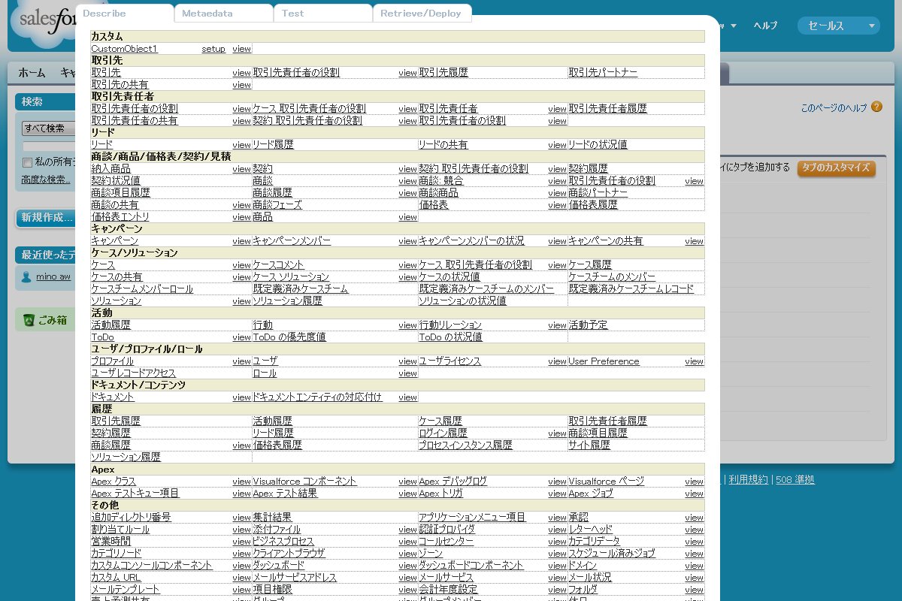
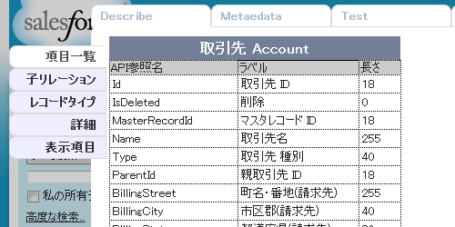
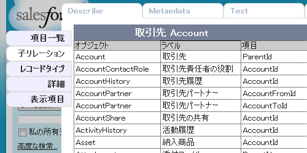
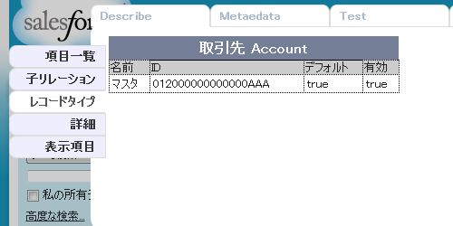
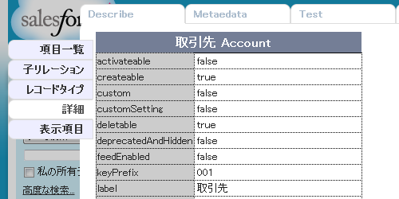
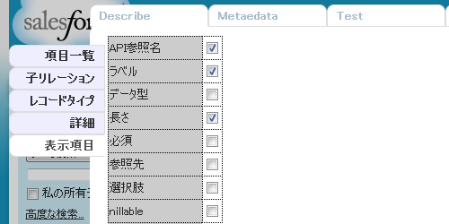
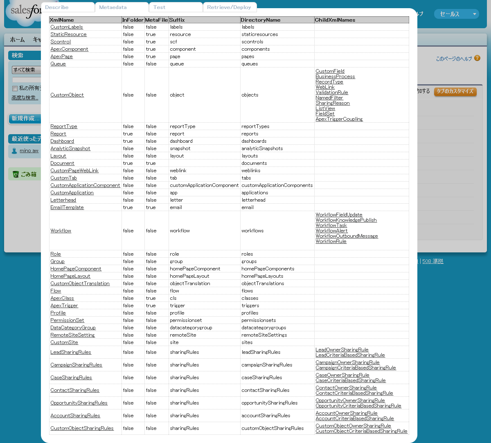

### これなに
Salesforceのオブジェクト定義やメタデータを参照したり、retrieve/deployができる
Scriptish スクリプトです。

### インストール
0. [Scriptish](https://addons.mozilla.org/ja/firefox/addon/scriptish/)をインストール
0. [forcedotcommetadatatool.user.js](https://raw.github.com/mino0123/Force.com-Metadata-Tool/master/forcedotcommetadatatool.user.js)をインストール

### 使い方
インストール後、Salesforceにログインしてから画面左上のロゴをクリックすることで使用できます。

※Visualforce画面では使用できません。

オブジェクトの一覧が画面上に表示されます。

### オブジェクト一覧
オブジェクト一覧画面には、オブジェクト名、設定へのリンク、ビューへのリンクが表示されます。

* オブジェクトの詳細を表示します
* setup カスタムオブジェクトのみ表示されます。設定画面へのリンクです。
* view  /{keyprefix} へのリンクです。対応しているオブジェクトならビューが表示されますが、サポートされてないオブジェクトもあります

### オブジェクト詳細

* 項目一覧

* 子リレーション

* レコードタイプ

* 詳細

* 表示項目 (「項目一覧」で表示される項目のプロパティを設定できます)

<!--
### メタデータ

### メタデータ詳細

### Retrieve/Deploy
単一ファイルの retrieve/deploy ができます。
* name
* member
* file
* directory
* basename
* extension
* meta file
-->

### bookmarklet

<pre style="overflow:scroll;white-space:pre;height:40px;" onclick="getSelection().selectAllChildren(this);">javascript:(function(t){function e(){t.sforce?MetadataTool.$.trigger(&quot;run&quot;):setTimeout(e,1e3)}if(t.MetadataTool)return e(),void 0;var o=[&quot;https://raw.github.com/mino0123/Force.com-Metadata-Tool/master/lib/jquery-1.8.3.min.js&quot;,&quot;https://raw.github.com/mino0123/Force.com-Metadata-Tool/master/lib/JSZip/jszip.js&quot;,&quot;https://raw.github.com/mino0123/Force.com-Metadata-Tool/master/lib/JSZip/jszip-load.js&quot;,&quot;https://raw.github.com/mino0123/Force.com-Metadata-Tool/master/lib/JSZip/jszip-inflate.js&quot;,&quot;https://raw.github.com/mino0123/Force.com-Metadata-Tool/master/lib/JSZip/jszip-deflate.js&quot;,&quot;https://raw.github.com/mino0123/Force.com-Metadata-Tool/master/lib/Hogan.js/hogan-2.0.0.min.js&quot;,&quot;https://raw.github.com/mino0123/Force.com-Metadata-Tool/master/forcedotcommetadatatool.user.js&quot;],a=e,i=o.reverse().map(function(t){var e=function(){var o=document.createElement(&quot;script&quot;);o.src=t,o.onload=e.next,document.head.appendChild(o)};return e.next=a,a=e,e});i[i.length-1](),t.GM_getValue=function(){return null},t.GM_setValue=function(){return null},t.GM_addStyle=function(t){var e=document.createElement(&quot;style&quot;);e.type=&quot;text/css&quot;,e.innerHTML=t,document.head.appendChild(e)}})(this);</pre>